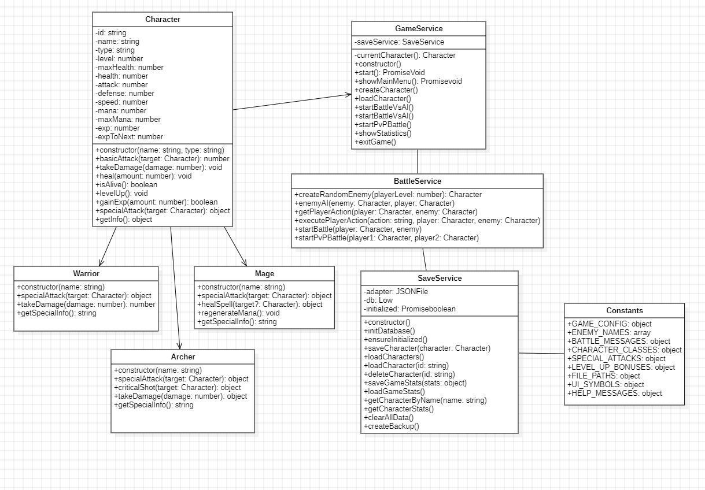

# 🎮 RPG BATTLE SIMULATOR

## ⚔️ **Simulador de Batallas RPG Épico y Súper Sencillo**

Un increíble simulador de batallas por turnos desarrollado en Node.js con una interfaz de consola súper genial. Incluye barras de progreso, colores épicos, efectos visuales increíbles y sistema de guardado local en JSON.

---

## 🌟 **Características Principales**

### ✨ **Visual y UX Increíbles**
- 🎨 **Colores épicos** con la librería Chalk
- 📊 **Barras de vida y maná** en tiempo real con cli-progress
- 🎲 **Spinners de carga** elegantes con Ora
- 🎪 **Títulos ASCII** geniales con Figlet
- 💫 **Animaciones y efectos** visuales en consola

### 🧙‍♂️ **Sistema de Personajes**
- **3 Clases únicas**:
  - 💪 **Guerrero**: Tank con alta vida y defensa
  - 🔮 **Mago**: Atacante mágico con curación
  - 🏹 **Arquero**: Rápido con probabilidad de esquivar

### ⚔️ **Sistema de Batallas**
- 🎯 **Batallas por turnos** súper dinámicas
- 🤖 **IA inteligente** para enemigos
- 👥 **Modo PvP** (Jugador vs Jugador)
- ✨ **Habilidades especiales** únicas por clase
- 🎲 **Sistema de críticos y esquivar**

### 💾 **Persistencia de Datos**
- 📁 **Guardado automático** en JSON local
- 📊 **Estadísticas del juego** completas
- 🔄 **Sistema de backup** integrado
- 📈 **Tracking de progreso** y experiencia

---

## 🎥 **Video Explicativo del Proyecto**

¡Mira nuestro video explicativo para entender mejor cómo funciona el simulador!

[](https://drive.google.com/file/d/1kAUJVx-MWSPD_W_4FVMYIqr0_cQyAoi2/view?usp=drive_link)

---

## 🚀 **Instalación Súper Fácil**

### **Prerequisitos**
- Node.js v16 o superior
- npm o yarn

### **Pasos de Instalación**

```bash
# 1. Clona el repositorio
git clone https://github.com/Deamacevedo/simulador-batallas-rpg.git
cd simulador-batallas-rpg

# 2. Instala las dependencias
npm install

# 3. ¡Ejecuta el juego!
npm start
```

---

## 🎮 **Cómo Jugar**

### **Menú Principal**
1. **⚔️ Crear Nuevo Personaje** - Crea tu héroe épico
2. **📁 Cargar Personaje** - Continúa tu aventura
3. **🏟️ Batalla vs IA** - Enfréntate a enemigos aleatorios
4. **👥 Batalla PvP** - Lucha contra tus otros personajes
5. **📊 Ver Estadísticas** - Revisa tu progreso

### **Creación de Personaje**
1. Escribe el nombre de tu héroe
2. Elige una clase (Guerrero, Mago, Arquero)
3. ¡Listo! Tu personaje se guarda automáticamente

### **Sistema de Combate**
- **Ataque Básico**: Daño normal, sin costo de maná
- **Ataque Especial**: Más daño, pero consume maná
- **Curación** (solo Mago): Restaura vida gastando maná

---

## 🏗️ **Arquitectura del Proyecto (SOLID)**

### **Estructura de Carpetas**
```
src/
├── index.js                 # 🚀 Punto de entrada
├── models/                  # 🎭 Clases de personajes
│   ├── Character.js         #   └─ Clase base
│   ├── Warrior.js          #   └─ Guerrero
│   ├── Mage.js             #   └─ Mago
│   └── Archer.js           #   └─ Arquero
├── services/               # ⚙️ Lógica de negocio
│   ├── GameService.js      #   └─ Coordinador principal
│   ├── BattleService.js    #   └─ Sistema de batallas
│   └── SaveService.js      #   └─ Persistencia de datos
├── utils/                  # 🛠️ Utilidades
│   ├── Display.js          #   └─ Efectos visuales
│   └── constants.js        #   └─ Configuración
└── data/                   # 💾 Datos guardados
    └── saved-characters.json
```

### **Principios SOLID Aplicados**

#### **🎯 SRP (Single Responsibility Principle)**
- **Character**: Solo maneja propiedades básicas del personaje
- **BattleService**: Solo maneja lógica de batallas
- **SaveService**: Solo maneja persistencia de datos
- **Display**: Solo maneja visualización y efectos

#### **🔓 OCP (Open/Closed Principle)**
- Nuevas clases de personajes se pueden agregar sin modificar código existente
- Sistema de habilidades extensible

#### **🔄 LSP (Liskov Substitution Principle)**
- Todas las clases (Warrior, Mage, Archer) pueden usarse como Character
- Polimorfismo perfecto en habilidades especiales

#### **🧩 ISP (Interface Segregation Principle)**
- Métodos específicos por clase (healSpell solo en Mage)
- Interfaces limpias y específicas

#### **⬆️ DIP (Dependency Inversion Principle)**
- GameService depende de abstracciones, no implementaciones concretas
- Fácil intercambio de componentes

---

## 🛠️ **Tecnologías Utilizadas**

### **Librerías Principales**
- **🎨 chalk** - Colores épicos en consola
- **❓ inquirer** - Menús interactivos súper intuitivos
- **📊 cli-progress** - Barras de progreso geniales
- **⭕ ora** - Spinners de carga elegantes
- **🎪 figlet** - Texto ASCII épico
- **💾 lowdb** - Base de datos JSON súper simple
- **🆔 uuid** - IDs únicos para personajes

### **Características Técnicas**
- **ES6 Modules** - Código moderno y limpio
- **Async/Await** - Manejo asíncrono elegante
- **Error Handling** - Manejo robusto de errores
- **JSON Storage** - Persistencia local sencilla

---

## 📊 **Diagrama de Clases UML**



---

## 🎯 **Características de las Clases**

### 💪 **Guerrero**
- **Ventajas**: Alta vida y defensa, recibe 10% menos daño
- **Habilidad**: Golpe Devastador (180% daño, 15 maná)
- **Estilo**: Tank perfecto para combate prolongado

### 🔮 **Mago**
- **Ventajas**: Alto maná, regeneración +5 por turno
- **Habilidades**: 
  - Bola de Fuego (250% daño, 20 maná)
  - Curación (40% vida, 25 maná)
- **Estilo**: Versatilidad máxima entre daño y soporte

### 🏹 **Arquero**
- **Ventajas**: Alta velocidad, 20% probabilidad de esquivar
- **Habilidades**:
  - Flecha Múltiple (3 flechas, 18 maná)
  - Disparo Certero (160% crítico, 12 maná)
- **Estilo**: Hit-and-run con alta movilidad

---

## 📈 **Sistema de Progresión**

### **Experiencia y Niveles**
- **EXP por victoria**: 25 × nivel enemigo + bonus aleatorio
- **Subida de nivel**: +20 vida, +5 ataque, +3 defensa, +2 velocidad, +10 maná
- **Nivel máximo**: 50 (configurable)

### **Estadísticas Guardadas**
- Batallas ganadas/perdidas
- Experiencia total ganada
- Ratio de victoria
- Personajes por clase
- Nivel más alto alcanzado

---

## 🎮 **Capturas de Pantalla**

```
🎮 RPG BATTLE SIMULATOR 🎮
⚔️  SIMULADOR DE BATALLAS ÉPICO  ⚔️

🎮 ¿Qué deseas hacer?
❯ ⚔️  Crear Nuevo Personaje
  📁 Cargar Personaje Guardado
  🏟️  Batalla vs IA
  👥 Batalla PvP
  📊 Ver Estadísticas
  ❌ Salir

═══════════════════════════════════════════════════════
                    TURNO 1
═══════════════════════════════════════════════════════

❤️  Vida |████████████████████| 100% | 130/130 HP
🔵 Maná |██████████████████  | 90% | 27/30 MP

💥 ¡Héroe inflige 45 de daño especial a Goblin Feroz!
   Goblin Feroz tiene 55/100 HP (55%)
```


## 👨‍💻 **Autor**

**Tu Nombre Aquí**
- GitHub: [@deamacevedo](https://github.com/deamacevedo)
- GitHub: [@jefersonlopezr](https://github.com/jefersonlopezr)

---

## 🎉 **¡Disfruta el Juego!**

¡Prepárate para batallas épicas y aventuras increíbles! ⚔️🎮

*"En el mundo de la programación, como en los RPG, cada línea de código es una aventura esperando ser vivida."*